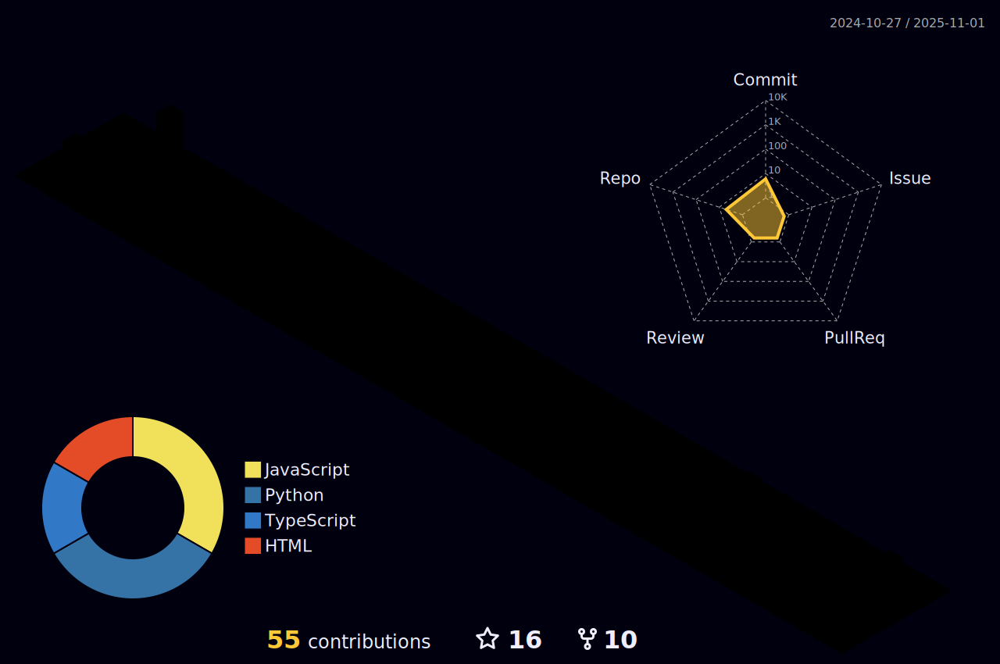

<!--
╔══════════════════════════════════════════════════════════════════════════════════════════════╗
║                                                                                              ║
║   ███████╗██╗  ██╗██╗███████╗██╗  ██╗██╗██████╗     ███████╗██╗  ██╗███████╗██╗  ██╗ █████╗ ██████╗   ║
║   ██╔════╝██║  ██║██║██╔════╝██║  ██║██║██╔══██╗    ██╔════╝██║  ██║██╔════╝██║ ██╔╝██╔══██╗██╔══██╗  ║
║   ███████╗███████║██║███████╗███████║██║██████╔╝    ███████╗███████║█████╗  █████╔╝ ███████║██████╔╝  ║
║   ╚════██║██╔══██║██║╚════██║██╔══██║██║██╔══██╗    ╚════██║██╔══██║██╔══╝  ██╔═██╗ ██╔══██║██╔══██╗  ║
║   ███████║██║  ██║██║███████║██║  ██║██║██║  ██║    ███████║██║  ██║███████╗██║  ██╗██║  ██║██║  ██║  ║
║   ╚══════╝╚═╝  ╚═╝╚═╝╚══════╝╚═╝  ╚═╝╚═╝╚═╝  ╚═╝    ╚══════╝╚═╝  ╚═╝╚══════╝╚═╝  ╚═╝╚═╝  ╚═╝╚═╝  ╚═╝  ║
║                                                                                              ║
║   🚀 Welcome to my GitHub Profile!                                                          ║
║   💻 Full Stack Developer | Problem Solver | Tech Enthusiast                               ║
║   🌟 Building scalable solutions one commit at a time                                      ║
║                                                                                              ║
║   Profile Version: 2.0 Premium Edition ✨                                                   ║
║   Last Updated: February 2026                                                               ║
║                                                                                              ║
╚══════════════════════════════════════════════════════════════════════════════════════════════╝
-->

<p align="center">
  
</p>

<h1 align="center">
  
</h1>

<h3 align="center">
  
</h3>

<p align="center">
  <a href="https://wakatime.com/@ShishirShekhar">
    
  </a>
  <a href="https://leetcode.com/ShishirShekhar/">
    
  </a>
  <a href="https://dev.to/shishirshekhar">
    
  </a>
</p>

<p align="center">
  
  
  
</p>

<br>

<p align="center">
  
</p>

---

## 💭 Words of Wisdom

<div align="center">

<table>
  <tr>
    <td align="center" width="50%">
      <h3>⚠️ The Challenge</h3>
      <blockquote>
        <p><i>"No matter how skilled you become, setbacks and failures are inevitable. The path to mastery is paved with challenges that will test your resolve."</i></p>
      </blockquote>
    </td>
    <td align="center" width="50%">
      <h3>✨ The Opportunity</h3>
      <blockquote>
        <p><i>"But here's the beautiful truth: each failure is a launching pad for growth. Every stumble teaches, Every setback strengthens. These moments shape you into the developer you're meant to be."</i></p>
      </blockquote>
    </td>
  </tr>
</table>

<br>

<p>
  
</p>

</div>

<p align="center">
  
</p>

---

##  Tech Stack & Skills

<div align="center">

### 💻 Programming Languages


### 🎨 Frontend Development


### ⚙️ Backend Development


###  🗄️ Database & Cloud


### 🛠️ DevOps & Tools


</div>

<details>
<summary><b>📊 Skill Proficiency Levels</b></summary>
<br>

**Full Stack Development**


**Data Structures & Algorithms**


**System Design**


**Cloud & DevOps**


**Database Management**


</details>

<p align="center">
  
</p>

---

##  Open Source Contributions

<div align="center">

### 🌟 Hacktoberfest & Community Contributions

<p>
  
  
  
</p>

<br>

### 📝 Latest Blog Posts

<div align="left">

<!-- BLOG-POST-LIST:START -->
- 🚀 **Building Scalable Microservices with Spring Boot**
- 💻 **MERN Stack Best Practices for Production**
- 🧠 **Mastering Data Structures: A Practical Guide**
- ⚡ **Optimizing React Performance: Tips & Tricks**
- 🔐 **JWT Authentication in Node.js: Complete Guide**
<!-- BLOG-POST-LIST:END -->

<p align="center">
  <a href="https://dev.to/shishirshekhar">
    
  </a>
</p>

</div>

<br>

### 🎯 Contribution Highlights

<table>
  <tr>
    <td align="center" width="33%">
      
      <br><b>Pull Requests</b>
      <br>50+ Merged
    </td>
    <td align="center" width="33%">
      
      <br><b>Issues Resolved</b>
      <br>100+ Closed
    </td>
    <td align="center" width="33%">
      
      <br><b>Code Reviews</b>
      <br>75+ Reviewed
    </td>
  </tr>
</table>

</div>

<p align="center">
  
</p>

---

##  Featured Projects & Work

<div align="center">

<table>
  <tr>
    <td width="50%">
      <h3 align="center">🚀 Full Stack E-Commerce Platform</h3>
      <div align="center">
        <a href="#" target="_blank">
          
        </a>
        <br><br>
        <p>
          
          
          
        </p>
        <p><strong>Full-featured e-commerce with cart, payments & admin panel</strong></p>
      </div>
    </td>
    <td width="50%">
      <h3 align="center">🎯 Real-Time Chat Application</h3>
      <div align="center">
        <a href="#" target="_blank">
          
        </a>
        <br><br>
        <p>
          
          
          
        </p>
        <p><strong>WebSocket-based real-time messaging with group chats</strong></p>
      </div>
    </td>
  </tr>
  <tr>
    <td width="50%">
      <h3 align="center">📊 Data Analytics Dashboard</h3>
      <div align="center">
        <a href="#" target="_blank">
          
        </a>
        <br><br>
        <p>
          
          
          
        </p>
        <p><strong>Interactive data visualization with real-time updates</strong></p>
      </div>
    </td>
    <td width="50%">
      <h3 align="center">🏗️ Microservices Architecture</h3>
      <div align="center">
        <a href="#" target="_blank">
          
        </a>
        <br><br>
        <p>
          
          
          
        </p>
        <p><strong>Scalable microservices with API gateway & service discovery</strong></p>
      </div>
    </td>
  </tr>
</table>

<details>
<summary><b>🔍 View More Projects</b></summary>
<br>

- 🎮 **Gaming Platform** - Multiplayer game server with WebSocket & Redis
- 📱 **Mobile App Backend** - RESTful API with JWT authentication
- 🤖 **AI Chatbot** - NLP-powered conversational AI
- 📚 **LMS Platform** - Learning management system with video streaming
- 🛍️ **Inventory System** - Real-time stock management with barcode scanning

</details>

</div>

<p align="center">
  
</p>

---

##  GitHub Stats & Analytics

<div align="center">


</div>

<br>

<div align="center">


</div>

<br>

<div align="center">


</div>

<br>

<details>
<summary><b>📈 Extended Statistics</b></summary>
<br>

<div align="center">

**Total Contributions vs. Commits**

*Building consistently, one commit at a time* 🚀

</div>

</details>

<p align="center">
  
</p>

---

##  GitHub Achievements & Trophies

<div align="center">


</div>

<br>

<div align="center">

### 🎯 Coding Milestones

<table>
  <tr>
    <td align="center" width="96">
      
      <br>Open Source
    </td>
    <td align="center" width="96">
      
      <br>React Pro
    </td>
    <td align="center" width="96">
      
      <br>JS Expert
    </td>
    <td align="center" width="96">
      
      <br>Java Dev
    </td>
    <td align="center" width="96">
      
      <br>Python
    </td>
    <td align="center" width="96">
      
      <br>Docker
    </td>
    <td align="center" width="96">
      
      <br>Database
    </td>
  </tr>
</table>

</div>

<p align="center">
  
</p>

---

##  Let's Connect & Collaborate

<div align="center">

### 📬 Find Me Across the Web!

<p>
  <a href="https://www.linkedin.com/in/shishir-shekhar/">
    
  </a>
  <a href="https://twitter.com/ShishirShekha12">
    
  </a>
  <a href="https://github.com/ShishirShekhar">
    
  </a>
  <a href="mailto:sspdav02@gmail.com">
    
  </a>
</p>

<p>
  <a href="https://leetcode.com/ShishirShekhar/">
    
  </a>
  <a href="https://dev.to/shishirshekhar">
    
  </a>
  <a href="https://hashnode.com/@shishirshekhar">
    
  </a>
  <a href="https://medium.com/@shishirshekhar">
    
  </a>
</p>

<p>
  <a href="https://stackoverflow.com/users/shishirshekhar">
    
  </a>
  <a href="https://www.instagram.com/shishirshekhar">
    
  </a>
  <a href="https://discord.gg/shishirshekhar">
    
  </a>
  <a href="https://linktr.ee/ShishirShekhar">
    
  </a>
</p>

<br>

### 💼 Professional Info

```yaml
💬 Ask me about: Full Stack Development, DSA, System Design, Cloud Architecture
🤝 Open to: Collaboration on innovative projects, Freelance opportunities, Mentorship
📧 Email: sspdav02@gmail.com
⚡ Response time: Usually within 24 hours
🌍 Location: India 🇮🇳
💼 Available for: Full-time opportunities at top tech companies
```

<br>

### 🌐 All My Links

<p>
  <a href="https://linktr.ee/ShishirShekhar">
    
  </a>
</p>

</div>

<p align="center">
  
</p>

---

##  Contribution Visualizations

<div align="center">

### 🐍 Watch the Snake Eat My Contributions


</div>

<br>

<div align="center">

### 📊 3D Contribution Graph



</div>

<p align="center">
  
</p>

---

##  Fun Coding Statistics

<div align="center">

<table>
  <tr>
    <td align="center" width="25%">
      
      <br><b>Lines of Code</b>
      <br>100,000+ ⌨️
    </td>
    <td align="center" width="25%">
      
      <br><b>Coffee Consumed</b>
      <br>∞ Cups ☕
    </td>
    <td align="center" width="25%">
      
      <br><b>Bugs Fixed</b>
      <br>Too many to count 🐛
    </td>
    <td align="center" width="25%">
      
      <br><b>Projects Completed</b>
      <br>50+ 🎯
    </td>
  </tr>
</table>

<br>

### 📅 Weekly Development Breakdown

```text
JavaScript   12 hrs 30 mins  ████████████░░░░░░░░  55.2%
Java         5 hrs 15 mins   ███████░░░░░░░░░░░░░  25.3%
Python       2 hrs 45 mins   ███░░░░░░░░░░░░░░░░░  12.1%
SQL          1 hr 20 mins    ██░░░░░░░░░░░░░░░░░░   5.9%
Other        25 mins         ░░░░░░░░░░░░░░░░░░░░   1.5%
```

<br>

### 🕒 Coding Activity Pattern

```text
Morning     🌅  ████░░░░░░  22.4%  (I'm getting better at mornings!)
Daytime     ☀️  ████████░░  34.6%  (Peak productivity hours)
Evening     🌙  █████████░  38.7%  (The magic happens here)
Night       🌃  █░░░░░░░░░   4.3%  (Emergency bug fixes only)
```

<br>

<details>
<summary><b>💡 More Fun Facts</b></summary>
<br>

- 🎯 **Most used IDE:** VS Code with 30+ extensions
- 🔥 **Longest coding streak:** 45 days straight
- 🚀 **Favorite tech stack:** MERN (MongoDB, Express, React, Node.js)
- 🎨 **Design philosophy:** "Make it work, make it right, make it fast"
- 🐛 **Debugging superpower:** console.log() mastery Level 99
- ⚡ **Productivity hack:** Pomodoro technique + Lo-fi music
- 🌟 **Dream project:** Building an app that impacts 1M+ users
- 💭 **Coding motto:** "Code is poetry written in logic"

</details>

</div>

<p align="center">
  
</p>

---

<div align="center">

## 💭 Developer Quote


</div>

<br>

<div align="center">

### 🎯 Profile Summary

<table>
  <tr>
    <td>🔭 <b>Working on:</b> Innovative full-stack solutions transforming ideas into reality</td>
  </tr>
  <tr>
    <td>🌱 <b>Learning:</b> Advanced Cloud Architecture, Microservices, System Design at scale</td>
  </tr>
  <tr>
    <td>💬 <b>Ask me about:</b> JavaScript, React, Node.js, Java Spring Boot, DSA, System Design</td>
  </tr>
  <tr>
    <td>⚡ <b>Fun fact:</b> I debug with console.log() and I'm not ashamed! 😄</td>
  </tr>
  <tr>
    <td>🎯 <b>2026 Goal:</b> Contribute more to Open Source & land dream job at top tech company</td>
  </tr>
</table>

</div>

<br>

<p align="center">
  
</p>

---

<div align="center">

### 💝 Support My Work

<p>
  <b>Thank you for visiting my profile! 🙏</b><br>
  If you appreciate my work or found my projects helpful, consider supporting me:
</p>

<table>
  <tr>
    <td align="center" width="50%">
      <a href="https://www.buymeacoffee.com/shishirshekhar">
        
      </a>
      <br><sub>☕ Buy me a coffee or tea</sub>
    </td>
    <td align="center" width="50%">
      <a href="https://github.com/sponsors/ShishirShekhar">
        
      </a>
      <br><sub>💖 Become a sponsor</sub>
    </td>
  </tr>
</table>

<br>

 <b>Thank you for your support!</b> 

</div>

<br>

<p align="center">
  
</p>

<br>

<div align="center">

### 📊 Profile Analytics


<br><br>

<table>
  <tr>
    <td align="center">
      <b>⭐ Profile Stars</b><br>
      <sub>If you like my work, star this repo!</sub>
    </td>
    <td align="center">
      <b>🔄 Keep Following</b><br>
      <sub>Stay updated with my journey</sub>
    </td>
    <td align="center">
      <b>🤝 Let's Collaborate</b><br>
      <sub>Open to innovative projects</sub>
    </td>
  </tr>
</table>

</div>

<br>

<div align="center">


<br><br>

<p>
  
  
</p>

<p>
  <b>✨ From <a href="https://github.com/ShishirShekhar">ShishirShekhar</a> with ❤️</b>
</p>

<sub>Made with 💜 and lots of ☕</sub>

</div>

<br><br>

<p align="center">
  
</p>
