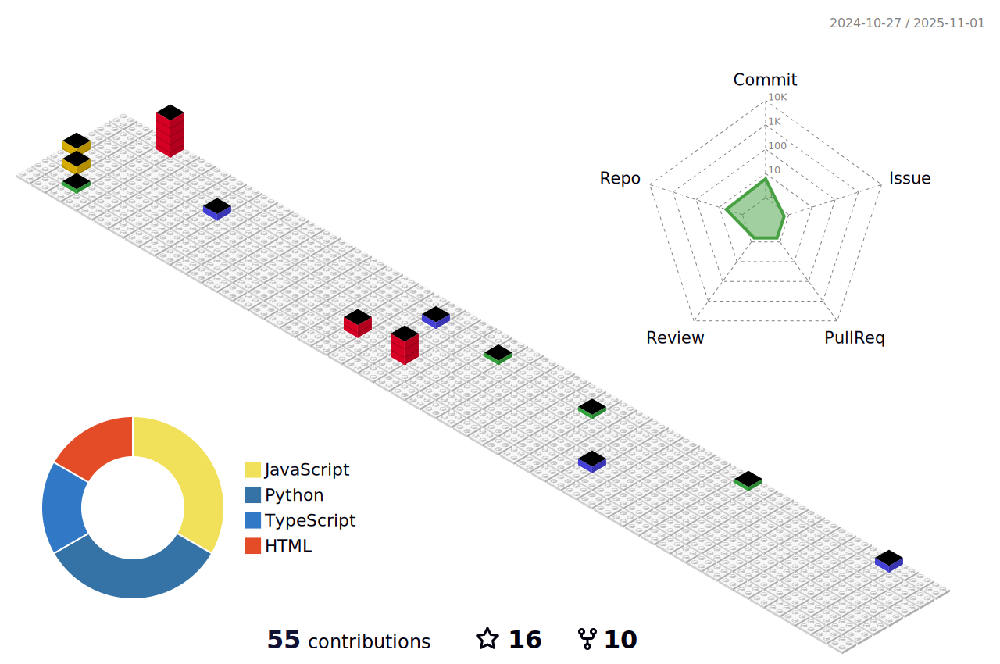

<h1 align="center">I'm a Developer and Student</h1>

- 👀 I’m interested in Full Stack Web Development, Data Science and Android Development
- 🌱 I’m currently learning everything 😂
- 💞️ I’m looking to collaborate with other amazing developers
- 🥅 2022 Goal: To create some amazing project
- ⚡ Fun Fact: I like watching anime

---

<h2> Skills  </h2>

### 📊 Some Fun Stats

|                         |  |
| ---------------------------------------------------------------------------------------------------------------------------- | ---------------------------------------------------------------------------------------------------------------- |
|  | 😠Total Views on Profile:     |

### 🏆 My trophies

### 🐍 Watch Snake eating my contribution

### 🎬 Watch animated commit

### 🤝 Connect with me

